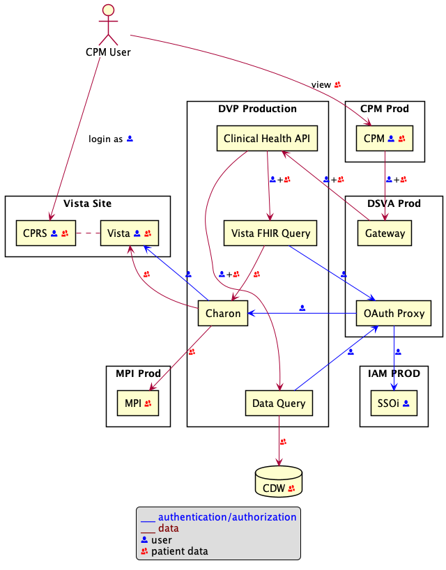
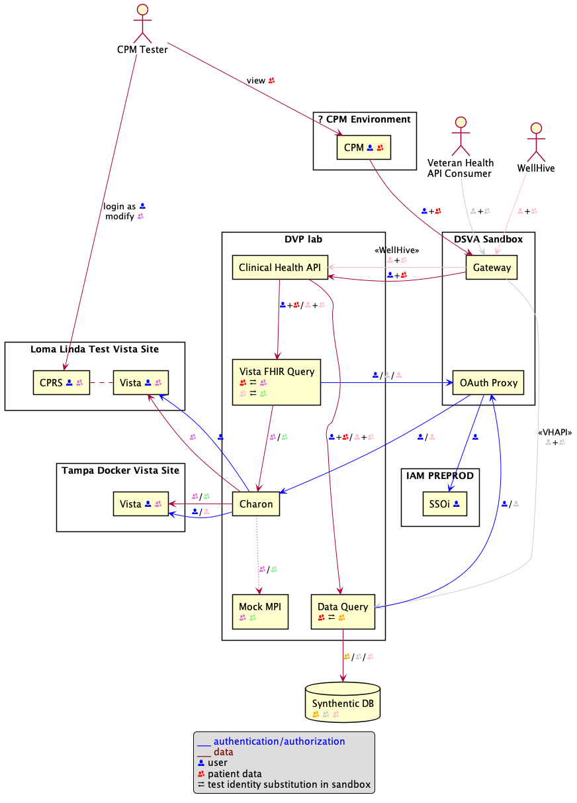
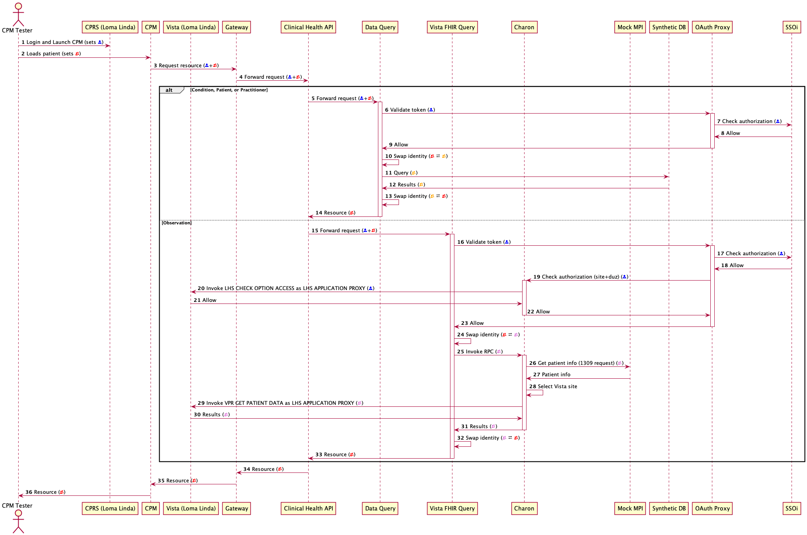

| DSVA                 | DVP         | MPI            | IAM     | Vista           | DQ DB    |
|----------------------|-------------|----------------|---------|-----------------|----------|
| `dev-api.va.gov`     | QA          | DISABLED (DEV) | INT     | Tampa Docker    | CDW      |
| -                    | UAT         |                | -       | -               | CDW      |
| -                    | Staging     | Pre-Prod       | -       | Test Vista Site | CDW      |
| -                    | Staging-Lab | DISABLED (SQA) | -       | Tampa Docker    | Synth DB |
| `staging-api.va.gov` | -           | -              | INT     | -               | -        |
| `sandbox-api.va.gov` | Lab         | DISABLED (SQA) | PREPROD | Tampa Docker    | Synth DB |
| `api.va.gov`         | Production  | Prod           | PROD    | Vista Site      | CDW      |

### Test Vista Site

One of the pilot sites for CPM.

- (`673`) Tampa, FL
- (`642`) Philadelphia, PA
- (`526`) Bronx, NY

### Disabled MPI Interaction

Under ideal circumstances, MPI is consulted when searching patient record to determine the Vista instances relevant for
a particular patient. Environments with _Tampa Docker_ instances for Vista have interaction with MPI disabled. In these
environments, MPI will not have information on the patient requested, or return Vista sites that are not Tampa resulting
in no data found. Instead all known vistas are queried, which happens to be the one dockerized Tampa instance.

### Tampa Docker

Environments using the `Tampa Docker` Vista environment are subject the follow characteristics:

- Data set is well known and change controlled
- No user access to running Vista instances, e.g. no CPRS
- Limited variability in data, e.g., COVID-19 data is not available
- Limited patients that do not necessarily match Data Query records

_Vista FHIR Query_, the API in front of Vista data, provides an _Alternate IDs_ capability in lower environments that
allows one test patient ID to be mapped to different test patient ID. This provides data compatibility for a limited set
of patients across Data Query/Synth DB and Vista FHIR Query/Tampa Docker.

External Vista applications like CPRS could potentially be connected to the Tampa Docker by exposing the RPC Broker
outside of the containing VPC. Deployment changes are required. Ports will need to be opened in the VPC.

### SSOi

- We have a single SSOi test account (`TEST_SKLFORNEW`) in PREPROD (Sandbox) with a valid VistaID, NPI, ICN, etc.
- _**What test account should CPM use?**_
  > There is no single-sign-on between CPRS and CPM, so they'll use whatever test accounts we tell them about. Whether the data matches up with the environment they are launching from (e.g., sta3n and vista_id) is unknown and unlikely.

### `dev-api.va.gov`

- No SLA, volatile, subject to breakages
- Disabled MPI interaction
- Limited patient set spanning CDW and Tampa Docker
- SSOi not yet configured to support authorization fields needed by Lighthouse

### `staging-api.va.gov`

- No connectivity from Gateway to Data Query or Vista FHIR Query

### `sandbox-api.va.gov`

- Tampa Docker does not provide access to users to interact with data, e.g. CPM testers cannot add records to Vista.
- SSOi user with auth-related data does not have matching Practitioner entry in Synth DB.
- MPI integration is currently disabled, but could be mocked to direct certain patients to Loma Linda and others to Tampa Docker

Making it work (mostly)

- IAM and CPM agree on a test user that is available in both systems associated to `Test Vista Site`
  - The test users site could be aliased to `Test Vista Site` in Charon API if necessary.
- Vista patches applied to `Test Vista Site`
- MPI is still excluded from the equation
- Update Synth DB to include new Practitioner record for test user
- Connect Charon API to `Test Vista Site`
- Create new patients in Synth DB to match up with test patients. Alternative, Doppelgangers could be used if quality is
  not paramount for patient demographics, diagnoistic reports, etc.

### `api.va.gov`

- Clinical Health APIs not yet deployed
- SSOi not yet updated

---
# Production

# Sandbox

## Making cohesive test environment
### CPM Use Case

### Patient ID Mapping

> NOTE: Cannot map one patient ID to different Vista IDs in Loma Linda or Tampa

| CPM Patient | Test Patient                    |  ICN     | Loma Linda | Tampa Docker |
|-------------|---------------------------------|----------|------------|--------------|
| ?           | va.api.user+idme.101@gmail.com  | 32000225 | missing    | 5000000345   |
| ?           | va.api.user+idme.102@gmail.com  | 5000335  | missing    | 5000000348   |
| ?           | va.api.user+idme.103@gmail.com  | 25000126 | missing    | 5000000341   |
| ?           | va.api.user+idme.119@gmail.com  | 43000199 | missing    | missing      |

Condition records for CPM:
- va.api.user+idme.101@gmail.com `18` (several risk factors relating to CPM)
- va.api.user+idme.102@gmail.com `16` (several risk factors relating to CPM)
- va.api.user+idme.103@gmail.com `8` (at least one risk factor relating to CPM)
- va.api.user+idme.119@gmail.com `5` (Hypertension I think is the only CPM related item)

## Additional Considerations

- The Clinical FHIR API metadata and well-known will must refer to authorization
  server `https://[sandbox-]api.va.gov/oauth2/clinical-health/v1/*`